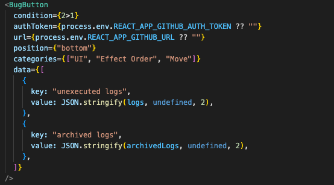
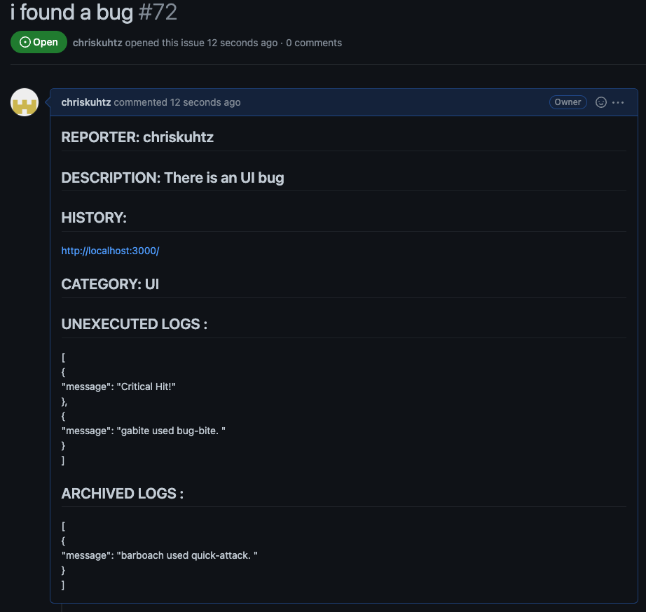
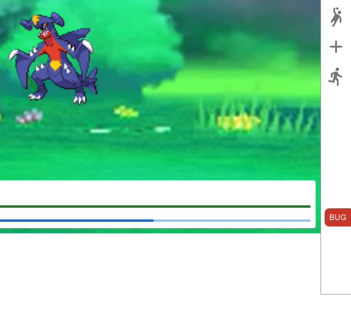
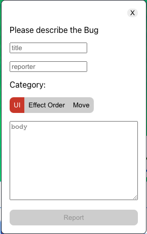

# BugButton
## a little red Button to report Bugs
## for Testers: create Github Issues without leaving the site you are testing
## for Developers: receive all relevant data to find and fix bugs directly into your Github Issues

BugButton is a React Component, simply at the root level of your React App.
BugButton creates Issues with two button presses, using the Github API.
You, as a developer, decide what important data you need in your issues. (e.g. parts of your Redux Store, React Router History).
Because of the condition Prop, BugButton only shows up when you want it to. (e.g. only on your QA Deployment, or only for certain userNames after a login)

## Properties:

### condition: boolean

any boolean condition (controls if the button is rendered)

### authToken: string 

github authToken of a user that has permissions to create issues on your repo (keep this safe and secret, obviously)

### url: string

the url to your github repo (e.g https://api.github.com/repos/chriskuhtz/pokemonModules/issues)

### position: "right"|"top"|"bottom"|"left"

the edge of your screen on which the Button will be located

### categories(optional): string[]

your own categories to classify your issues (e.g UI,API,Routing)

### data(optional): {key:string, value:string}[]

any data you need in your issue report to better understand the issue (e.g State,Redux Store, Session Storage, API Responses)

simply JSON stringify it

## What BugButton Reports look like:

Unexecuted Logs and archived Logs are slices of the applications Redux store, passed in as data elements. (see the code example above)

## What BugButton looks like:

